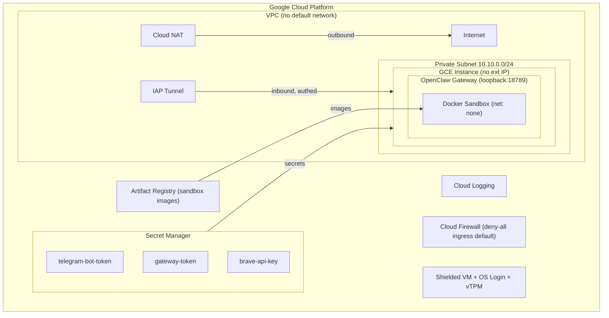
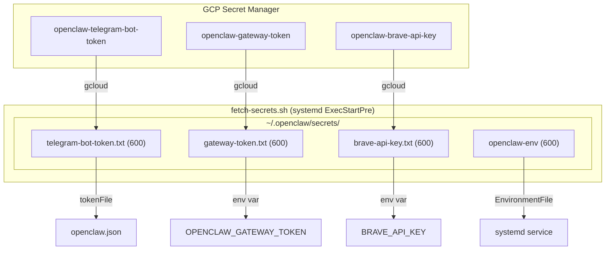

# OpenClaw Secure Configuration on Google Cloud Platform

A practitioner's guide to deploying and hardening OpenClaw on GCP. Covers every security-relevant configuration surface with GCP-native services, provides a click-to-deploy Terraform module, and includes a secure-by-default `openclaw.json`.

**Applies to:** OpenClaw 2026.3.x on Google Cloud Platform
**Last updated:** 2026-03-24

---

## Table of Contents

1. [Architecture Overview](#1-architecture-overview)
2. [Click-to-Deploy with Terraform](#2-click-to-deploy-with-terraform)
3. [GCP Secret Manager Integration](#3-gcp-secret-manager-integration)
4. [VPC Network & Cloud Firewall](#4-vpc-network--cloud-firewall)
5. [Identity-Aware Proxy (IAP) SSH Access](#5-identity-aware-proxy-iap-ssh-access)
6. [Service Account & IAM (Least Privilege)](#6-service-account--iam-least-privilege)
7. [GCE Instance Hardening](#7-gce-instance-hardening)
8. [Gateway Authentication & Network Binding](#8-gateway-authentication--network-binding)
9. [Channel Access Control (DMs & Groups)](#9-channel-access-control-dms--groups)
10. [Session Isolation](#10-session-isolation)
11. [Sandboxing on GCP](#11-sandboxing-on-gcp)
12. [Artifact Registry for Sandbox Images](#12-artifact-registry-for-sandbox-images)
13. [GCP Metadata Endpoint Protection](#13-gcp-metadata-endpoint-protection)
14. [Tool Policy & Exec Approvals](#14-tool-policy--exec-approvals)
15. [Logging with Cloud Logging](#15-logging-with-cloud-logging)
16. [File Permissions](#16-file-permissions)
17. [Plugin Security](#17-plugin-security)
18. [Host-Level Hardening (GCE)](#18-host-level-hardening-gce)
19. [Backups & Disaster Recovery](#19-backups--disaster-recovery)
20. [Incident Response](#20-incident-response)
21. [Ongoing Maintenance](#21-ongoing-maintenance)
22. [Reference: Secure openclaw.json Template](#22-reference-secure-openclawjson-template)

---

## 1. Architecture Overview



**Key GCP services used:**

| GCP Service | Purpose | Security Benefit |
|-------------|---------|------------------|
| **Secret Manager** | Store Telegram token, gateway token, API keys | No plaintext secrets on disk or in config |
| **VPC + Cloud Firewall** | Network isolation | Deny-all ingress by default; no public IP |
| **Cloud NAT** | Outbound internet access | Instance has no external IP |
| **Identity-Aware Proxy** | SSH access | MFA-protected, identity-aware SSH; no SSH keys to manage |
| **Artifact Registry** | Private Docker image hosting | Sandbox images from trusted private registry |
| **Shielded VM** | Secure Boot + vTPM + Integrity Monitoring | Prevents bootkit/rootkit attacks |
| **OS Login** | Centralized SSH key management | IAM-based access; no project-wide SSH keys |
| **Cloud Logging** | Centralized log aggregation | Audit trail with retention policies |
| **Service Account** | Workload identity | Least-privilege IAM bindings per secret |

---

## 2. Click-to-Deploy with Terraform

The complete Terraform module is in `terraform-openclaw-gcp/`. It provisions all infrastructure with secure defaults.

### 2.1 Prerequisites

```bash
# Install Terraform
curl -fsSL https://releases.hashicorp.com/terraform/1.9.0/terraform_1.9.0_linux_amd64.zip -o tf.zip
unzip tf.zip && sudo mv terraform /usr/local/bin/

# Authenticate to GCP
gcloud auth application-default login
```

### 2.2 Quick Start

```bash
cd terraform-openclaw-gcp/

# Copy and edit the example variables
cp terraform.tfvars.example terraform.tfvars
# Edit terraform.tfvars with your project_id and telegram_bot_token

# Initialize, plan, and apply
terraform init
terraform plan -out=deploy.tfplan
terraform apply deploy.tfplan
```

### 2.3 Terraform Module Structure

```
terraform-openclaw-gcp/
├── main.tf                    # Core infrastructure (VPC, GCE, IAM, Secrets)
├── variables.tf               # All configurable parameters with secure defaults
├── outputs.tf                 # SSH command, instance IP, Artifact Registry URL
├── terraform.tfvars.example   # Example variables (copy to terraform.tfvars)
├── .gitignore                 # Excludes .tfstate, terraform.tfvars
├── scripts/
│   └── startup.sh             # GCE startup script (install + harden + configure)
└── templates/
    └── openclaw-secure.json   # Secure-by-default OpenClaw config template
```

### 2.4 What the Terraform Module Creates

| Resource | Configuration | Security Default |
|----------|--------------|------------------|
| `google_compute_network` | Custom VPC, no auto subnets | No default network |
| `google_compute_subnetwork` | Private subnet with flow logs | `private_ip_google_access: true` |
| `google_compute_firewall` (deny-all) | Priority 65534 deny-all ingress | Blocks all unsolicited traffic |
| `google_compute_firewall` (IAP SSH) | Allow SSH from `35.235.240.0/20` only | IAP-authenticated SSH only |
| `google_compute_router_nat` | Cloud NAT for outbound | No external IP needed |
| `google_service_account` | Dedicated SA | No Editor/Owner roles |
| `google_secret_manager_secret` (x3) | Telegram token, gateway token, Brave key | Encrypted at rest, per-secret IAM |
| `google_artifact_registry_repository` | Private Docker registry | Reader-only access for SA |
| `google_compute_instance` | Shielded VM, OS Login, no external IP | Secure Boot + vTPM + Integrity |

### 2.5 Secure-by-Default Terraform Configuration Highlights

The Terraform module enforces these security properties that cannot be weakened without explicit variable changes:

**Network isolation:**
```hcl
# main.tf -- No external IP on the instance
network_interface {
  subnetwork = google_compute_subnetwork.subnet.id
  # No access_config block = no external IP
}
```

**Shielded VM:**
```hcl
# main.tf -- Hardware-backed security
shielded_instance_config {
  enable_secure_boot          = true
  enable_vtpm                 = true
  enable_integrity_monitoring = true
}
```

**OS Login (no project-wide SSH keys):**
```hcl
# main.tf -- IAM-based SSH access
metadata = {
  enable-oslogin         = "TRUE"
  block-project-ssh-keys = "TRUE"
  serial-port-enable     = "FALSE"
}
```

**Per-secret IAM (not project-level):**
```hcl
# main.tf -- Each secret gets its own IAM binding
resource "google_secret_manager_secret_iam_member" "telegram_accessor" {
  secret_id = google_secret_manager_secret.telegram_bot_token.secret_id
  role      = "roles/secretmanager.secretAccessor"
  member    = "serviceAccount:${google_service_account.openclaw.email}"
}
```

### 2.6 Post-Deploy Verification

After `terraform apply`, verify the deployment:

```bash
# Get the SSH command from Terraform output
$(terraform output -raw ssh_via_iap)

# On the instance:
sudo systemctl status openclaw-gateway.service
openclaw security audit --deep
openclaw status
```

---

## 3. GCP Secret Manager Integration

### 3.1 Why Secret Manager

Every secret in OpenClaw has an alternative injection method -- never store secrets in `openclaw.json`:

| Problem | Solution |
|---------|----------|
| Plaintext in config file | GCP Secret Manager (encrypted at rest with Google-managed or CMEK keys) |
| Config backups expose secrets | Secrets fetched at runtime, never written to config |
| Shared `.env` files | `tokenFile` and environment variable injection |
| No rotation workflow | Secret Manager versioning with automatic rotation |

### 3.2 Secret Resolution Architecture



### 3.3 Secret Resolution Chains

OpenClaw resolves each secret through a precedence chain. Use the highest-priority external method available.

| Secret | Config key | Environment variable | File-based | Recommended (GCP) |
|--------|-----------|---------------------|------------|-------------------|
| Telegram bot token | `channels.telegram.botToken` | `TELEGRAM_BOT_TOKEN` | `channels.telegram.tokenFile` | **tokenFile via Secret Manager** |
| Gateway auth token | `gateway.auth.token` | `OPENCLAW_GATEWAY_TOKEN` | N/A | **env var via Secret Manager** |
| Brave Search API key | `tools.web.search.apiKey` | `BRAVE_API_KEY` | N/A | **env var via Secret Manager** |
| Discord bot token | `channels.discord.token` | `DISCORD_BOT_TOKEN` | N/A | **env var via Secret Manager** |
| Slack bot/app tokens | `channels.slack.*Token` | `SLACK_BOT_TOKEN` / `SLACK_APP_TOKEN` | N/A | **env var via Secret Manager** |
| LINE channel secret | `channels.line.channelSecret` | N/A | `channels.line.secretFile` | **secretFile via Secret Manager** |

### 3.4 Creating Secrets (Manual)

If not using Terraform, create secrets manually:

```bash
PROJECT="your-project-id"
SA_EMAIL="openclaw-gateway@${PROJECT}.iam.gserviceaccount.com"

# Create secrets
echo -n "YOUR_TELEGRAM_TOKEN" | \
  gcloud secrets create openclaw-telegram-bot-token \
    --data-file=- --project="$PROJECT"

echo -n "$(openssl rand -hex 24)" | \
  gcloud secrets create openclaw-gateway-token \
    --data-file=- --project="$PROJECT"

echo -n "YOUR_BRAVE_KEY" | \
  gcloud secrets create openclaw-brave-api-key \
    --data-file=- --project="$PROJECT"

# Grant access to the service account (per-secret, not project-level)
for SECRET in openclaw-telegram-bot-token openclaw-gateway-token openclaw-brave-api-key; do
  gcloud secrets add-iam-policy-binding "$SECRET" \
    --member="serviceAccount:$SA_EMAIL" \
    --role="roles/secretmanager.secretAccessor" \
    --project="$PROJECT"
done
```

### 3.5 Fetch Script (systemd ExecStartPre)

The Terraform module deploys this script automatically. For manual setups:

```bash
#!/usr/bin/env bash
set -euo pipefail

SECRETS_DIR="${HOME}/.openclaw/secrets"
PROJECT="your-project-id"

mkdir -p "${SECRETS_DIR}" && chmod 700 "${SECRETS_DIR}"

fetch_secret() {
  local secret_name="$1"
  local dest_file="$2"
  gcloud secrets versions access latest \
    --secret="${secret_name}" \
    --project="${PROJECT}" \
    > "${dest_file}" 2>/dev/null
  chmod 600 "${dest_file}"
  echo "[fetch-secrets] Wrote ${dest_file}"
}

fetch_secret "openclaw-telegram-bot-token" "${SECRETS_DIR}/telegram-bot-token.txt"
fetch_secret "openclaw-gateway-token"      "${SECRETS_DIR}/gateway-token.txt"
fetch_secret "openclaw-brave-api-key"      "${SECRETS_DIR}/brave-api-key.txt"

# Generate systemd EnvironmentFile
ENV_FILE="${SECRETS_DIR}/openclaw-env"
{
  echo "OPENCLAW_GATEWAY_TOKEN=$(cat "${SECRETS_DIR}/gateway-token.txt")"
  echo "BRAVE_API_KEY=$(cat "${SECRETS_DIR}/brave-api-key.txt")"
} > "${ENV_FILE}"
chmod 600 "${ENV_FILE}"
```

### 3.6 Config Using tokenFile

```json
{
  "channels": {
    "telegram": {
      "tokenFile": "/home/openclaw/.openclaw/secrets/telegram-bot-token.txt"
    }
  }
}
```

### 3.7 Secret Rotation

```bash
# Create a new version (previous versions remain accessible until destroyed)
echo -n "NEW_TOKEN" | \
  gcloud secrets versions add openclaw-telegram-bot-token --data-file=-

# Restart gateway to pick up new secrets
sudo systemctl restart openclaw-gateway.service

# After verifying, destroy the old version
gcloud secrets versions destroy 1 --secret=openclaw-telegram-bot-token
```

### 3.8 CMEK (Customer-Managed Encryption Keys)

For additional control, encrypt secrets with Cloud KMS:

```bash
# Create a KMS key
gcloud kms keyrings create openclaw-ring --location=global
gcloud kms keys create openclaw-key --keyring=openclaw-ring \
  --location=global --purpose=encryption

# Create secret with CMEK
gcloud secrets create openclaw-telegram-bot-token \
  --replication-policy="user-managed" \
  --locations="us-central1" \
  --kms-key-name="projects/PROJECT/locations/global/keyRings/openclaw-ring/cryptoKeys/openclaw-key"
```

---

## 4. VPC Network & Cloud Firewall

### 4.1 Custom VPC (No Default Network)

The Terraform module creates a custom VPC instead of using the default network, which has overly permissive firewall rules.

```hcl
# Terraform creates this automatically
resource "google_compute_network" "vpc" {
  name                    = "openclaw-vpc"
  auto_create_subnetworks = false  # No auto-subnets = no surprise routes
}

resource "google_compute_subnetwork" "subnet" {
  name                     = "openclaw-vpc-subnet"
  ip_cidr_range            = "10.10.0.0/24"
  private_ip_google_access = true  # Access Google APIs without external IP

  log_config {  # VPC Flow Logs for network audit
    aggregation_interval = "INTERVAL_5_SEC"
    flow_sampling        = 0.5
    metadata             = "INCLUDE_ALL_METADATA"
  }
}
```

### 4.2 Cloud Firewall Rules

The module creates a **deny-all ingress** default with explicit allowlists:

| Rule | Priority | Action | Source | Ports | Purpose |
|------|----------|--------|--------|-------|---------|
| `deny-all-ingress` | 65534 | **DENY** | `0.0.0.0/0` | All | Default deny |
| `allow-iap-ssh` | 1000 | ALLOW | `35.235.240.0/20` | TCP/22 | IAP-authenticated SSH |
| `allow-internal` | 1000 | ALLOW | `10.10.0.0/24` | TCP/UDP/ICMP | Intra-subnet traffic |

**No public-facing ports are opened.** The OpenClaw gateway binds to `127.0.0.1:18789` (loopback) and is never exposed to the network.

### 4.3 Cloud NAT (No External IP)

The instance has **no external IP**. Outbound internet access (for Telegram API, npm, etc.) goes through Cloud NAT:

```hcl
resource "google_compute_router_nat" "nat" {
  name                               = "openclaw-vpc-nat"
  nat_ip_allocate_option             = "AUTO_ONLY"
  source_subnetwork_ip_ranges_to_nat = "ALL_SUBNETWORKS_ALL_IP_RANGES"

  log_config {
    enable = true
    filter = "ERRORS_ONLY"
  }
}
```

### 4.4 No Host-Level Firewall Needed

Network security is handled entirely by GCP VPC firewall rules (deny-all ingress + IAP SSH allowlist). No host-level `iptables` rules are configured — the VPC firewall operates at the network layer before traffic reaches the instance, and the instance has no external IP.

---

## 5. Identity-Aware Proxy (IAP) SSH Access

### 5.1 Why IAP Instead of Direct SSH

| Feature | Direct SSH | IAP SSH |
|---------|-----------|---------|
| External IP required | Yes | **No** |
| SSH keys to manage | Yes (project or instance) | **No** (IAM-based) |
| MFA support | Manual (PAM) | **Built-in** (Google 2FA) |
| Audit trail | `auth.log` only | **Cloud Audit Logs** |
| Network exposure | Port 22 open to internet | **Port 22 from 35.235.240.0/20 only** |

### 5.2 Connecting via IAP

```bash
# After terraform apply:
gcloud compute ssh openclaw-gateway \
  --zone=us-central1-c \
  --tunnel-through-iap \
  --project=your-project-id

# Or use the Terraform output:
$(terraform output -raw ssh_via_iap)
```

### 5.3 IAP IAM Permissions

Grant SSH access to specific users:

```bash
gcloud projects add-iam-policy-binding your-project-id \
  --member="user:admin@example.com" \
  --role="roles/iap.tunnelResourceAccessor"

gcloud projects add-iam-policy-binding your-project-id \
  --member="user:admin@example.com" \
  --role="roles/compute.osLogin"
```

---

## 6. Service Account & IAM (Least Privilege)

### 6.1 Dedicated Service Account

The Terraform module creates a dedicated service account with minimal permissions:

```
openclaw-gateway@PROJECT.iam.gserviceaccount.com
```

### 6.2 IAM Bindings

| Role | Scope | Purpose |
|------|-------|---------|
| `roles/secretmanager.secretAccessor` | Per-secret | Access individual secrets (not all secrets in project) |
| `roles/logging.logWriter` | Project | Write logs to Cloud Logging |
| `roles/monitoring.metricWriter` | Project | Write metrics to Cloud Monitoring |
| `roles/artifactregistry.reader` | Repository | Pull sandbox Docker images |

**What is NOT granted:**

| Role | Why Not |
|------|---------|
| `roles/editor` | Too broad -- grants write access to most GCP resources |
| `roles/owner` | Never grant to a service account |
| `roles/secretmanager.admin` | SA only needs to read secrets, not create/delete them |
| `roles/compute.admin` | SA should not modify its own instance |
| `roles/iam.serviceAccountTokenCreator` | Prevents token impersonation chains |

### 6.3 Per-Secret IAM (Not Project-Level)

Instead of granting `secretAccessor` at the project level, the Terraform module binds it per-secret:

```hcl
# Each secret has its own IAM binding -- the SA can only access OpenClaw secrets
resource "google_secret_manager_secret_iam_member" "telegram_accessor" {
  secret_id = google_secret_manager_secret.telegram_bot_token.secret_id
  role      = "roles/secretmanager.secretAccessor"
  member    = "serviceAccount:${google_service_account.openclaw.email}"
}
```

This means the service account cannot access any other secrets in the project.

---

## 7. GCE Instance Hardening

### 7.1 Shielded VM

The Terraform module enables all three Shielded VM features:

| Feature | Protection |
|---------|-----------|
| **Secure Boot** | Prevents unsigned bootloaders and kernels |
| **vTPM** | Hardware-backed key storage and integrity measurement |
| **Integrity Monitoring** | Detects changes to boot sequence, alerts in Cloud Logging |

### 7.2 OS Login

OS Login replaces project-wide SSH keys with IAM-based access:

```hcl
metadata = {
  enable-oslogin         = "TRUE"   # Use IAM for SSH access
  block-project-ssh-keys = "TRUE"   # Disable project-wide SSH keys
  serial-port-enable     = "FALSE"  # Disable serial console access
}
```

### 7.3 Dedicated OS User

The startup script creates a dedicated `openclaw` user:

```bash
useradd -m -s /bin/bash openclaw
```

OpenClaw runs as this user, not as root. All files under `~/.openclaw/` are owned by this user with restrictive permissions.

### 7.4 Systemd Service Hardening

The systemd unit includes security directives:

```ini
[Service]
User=openclaw
NoNewPrivileges=true
ProtectSystem=strict
ProtectHome=read-only
ReadWritePaths=/home/openclaw/.openclaw /home/openclaw/.config /var/log/openclaw /tmp
PrivateTmp=true
ProtectKernelTunables=true
ProtectKernelModules=true
ProtectControlGroups=true
RestrictSUIDSGID=true
```

---

## 8. Gateway Authentication & Network Binding

### 8.1 Bind Mode

```json
{
  "gateway": {
    "bind": "loopback"
  }
}
```

| Value | What it does | GCP recommendation |
|-------|-------------|-------------------|
| `"loopback"` | Binds to `127.0.0.1` only | **Default, recommended.** Combined with no external IP + Cloud Firewall deny-all. |
| `"tailnet"` | Binds to Tailscale IP only | Multi-machine with Tailscale mesh. |
| `"lan"` | Binds to `0.0.0.0` (all interfaces) | **Avoid.** Even with VPC firewall, defense-in-depth requires loopback binding. |

### 8.2 Auth Mode

```json
{
  "gateway": {
    "auth": {
      "mode": "token"
    }
  }
}
```

The gateway token is stored in Secret Manager and injected via `OPENCLAW_GATEWAY_TOKEN` environment variable. It is never stored in `openclaw.json`.

Generate a strong token:
```bash
openssl rand -hex 24
```

### 8.3 Control UI Security

```json
{
  "gateway": {
    "controlUi": {
      "allowInsecureAuth": false,
      "dangerouslyDisableDeviceAuth": false
    }
  }
}
```

Both must remain `false` in production.

---

## 9. Channel Access Control (DMs & Groups)

### 9.1 DM Policy

```json
{
  "channels": {
    "telegram": {
      "dmPolicy": "pairing"
    }
  }
}
```

| Policy | Behavior | Security level |
|--------|----------|----------------|
| `"pairing"` | Unknown senders get a one-time code; must be approved | **High (default, recommended)** |
| `"allowlist"` | Only pre-approved user IDs can interact | **High** |
| `"open"` | Anyone can DM (requires explicit `"*"` in allowlist) | **Low -- avoid in production** |
| `"disabled"` | All DMs ignored | **Maximum** |

### 9.2 Group Policy

```json
{
  "channels": {
    "telegram": {
      "groupPolicy": "allowlist"
    }
  }
}
```

| Policy | Behavior | Security level |
|--------|----------|----------------|
| `"allowlist"` | Only explicitly configured groups | **High (default, recommended)** |
| `"open"` | Responds in any group it's added to | **Low** |
| `"disabled"` | Ignores all group messages | **Maximum** |

### 9.3 Mention Gating in Groups

```json
{
  "channels": {
    "telegram": {
      "groups": {
        "<group-id>": {
          "requireMention": true
        }
      }
    }
  },
  "messages": {
    "ackReactionScope": "group-mentions"
  }
}
```

---

## 10. Session Isolation

### 10.1 DM Scope

```json
{
  "session": {
    "dmScope": "per-channel-peer"
  }
}
```

| Scope | Isolation | When to use |
|-------|-----------|-------------|
| `"main"` | All DMs share one session | Single-user, single-channel only |
| `"per-peer"` | One session per sender (cross-channel) | Single-user, multiple channels |
| `"per-channel-peer"` | One session per sender per channel | **Recommended for most deployments** |
| `"per-account-channel-peer"` | Adds account-level isolation | Multi-account setups |

**Risk with `"main"`:** If multiple users can DM the bot, they all share the same conversation context.

---

## 11. Sandboxing on GCP

### 11.1 Enable Sandboxing

```json
{
  "agents": {
    "defaults": {
      "sandbox": {
        "mode": "all",
        "workspaceAccess": "ro"
      }
    }
  }
}
```

| Mode | Behavior |
|------|----------|
| `"off"` | No sandboxing. **Not recommended.** |
| `"non-main"` | Sandboxes subagents only |
| `"all"` | **Recommended.** All agents sandboxed. |

### 11.2 Docker Hardening (Secure Defaults)

The secure `openclaw.json` configures:

```json
{
  "agents": {
    "defaults": {
      "sandbox": {
        "mode": "all",
        "workspaceAccess": "ro",
        "docker": {
          "image": "us-central1-docker.pkg.dev/PROJECT/openclaw-sandbox/openclaw-sandbox:latest",
          "network": "none",
          "tmpfs": ["/tmp:exec,mode=1777"],
          "memory": "512m",
          "cpus": "1.0",
          "pidsLimit": 256
        },
        "browser": {
          "allowHostControl": false
        }
      }
    }
  }
}
```

| Control | Secure Default | Why |
|---------|---------------|-----|
| Image source | Private Artifact Registry | No public Docker Hub supply-chain risk |
| Network | `"none"` | No outbound access, no metadata endpoint access |
| Memory | `"512m"` | Prevents OOM-killing the gateway |
| CPU | `"1.0"` | Prevents CPU exhaustion |
| PID limit | `256` | Prevents fork bombs |
| Workspace | `"ro"` | Read-only workspace mount |
| ReadonlyRootfs | `true` (Docker default) | Prevents filesystem modification |
| CapDrop | `ALL` (Docker default) | Zero Linux capabilities |
| No-new-privileges | `true` (Docker default) | Prevents SUID/setuid escalation |
| Browser control | `false` | Sandboxed agents cannot control host browser |

### 11.3 When Sandbox Needs Network

If the sandbox requires internet access (e.g., for `terraform init`), switch to `"bridge"` and block the metadata endpoint:

```json
{
  "docker": {
    "network": "bridge"
  }
}
```

**You MUST also block the GCP metadata endpoint** -- see [Section 13](#13-gcp-metadata-endpoint-protection).

---

## 12. Artifact Registry for Sandbox Images

### 12.1 Private Registry

The Terraform module creates a private Artifact Registry repository:

```
us-central1-docker.pkg.dev/PROJECT/openclaw-sandbox/
```

### 12.2 Building and Pushing a Sandbox Image

Use the Dockerfile from `terraform-node-container/`:

```bash
# Authenticate Docker to Artifact Registry
gcloud auth configure-docker us-central1-docker.pkg.dev

# Build the sandbox image
cd terraform-node-container/
docker build -t us-central1-docker.pkg.dev/PROJECT/openclaw-sandbox/openclaw-sandbox:v1.0.0 .

# Push to Artifact Registry
docker push us-central1-docker.pkg.dev/PROJECT/openclaw-sandbox/openclaw-sandbox:v1.0.0

# Tag as latest
docker tag us-central1-docker.pkg.dev/PROJECT/openclaw-sandbox/openclaw-sandbox:v1.0.0 \
  us-central1-docker.pkg.dev/PROJECT/openclaw-sandbox/openclaw-sandbox:latest
docker push us-central1-docker.pkg.dev/PROJECT/openclaw-sandbox/openclaw-sandbox:latest
```

### 12.3 Image Security Best Practices

| Practice | Implementation |
|----------|---------------|
| Pin image tags | Use `v1.0.0`, not `latest`, in production config |
| Scan for vulnerabilities | `gcloud artifacts docker images scan IMAGE_URI` |
| Minimal base image | Use `node:trixie-slim` (smaller attack surface) |
| Cleanup policy | Artifact Registry keeps only 5 most recent versions |
| Non-root user | Dockerfile ends with `USER node` |

### 12.4 Cleanup Policy

The Terraform module configures automatic cleanup:

```hcl
cleanup_policies {
  id     = "keep-recent"
  action = "KEEP"
  most_recent_versions {
    keep_count = 5
  }
}
```

---

## 13. GCP Metadata Endpoint Protection

### 13.1 The Risk

GCE instances have a metadata endpoint at `169.254.169.254` that provides service account tokens. If the sandbox container has network access (`bridge` mode), it can request these tokens and impersonate the instance's service account.

```bash
# From inside an unprotected container:
curl -s -H "Metadata-Flavor: Google" \
  "http://169.254.169.254/computeMetadata/v1/instance/service-accounts/default/token"
# Returns a valid access token!
```

### 13.2 Defense: Network None (Default)

The secure `openclaw.json` uses `"network": "none"`, which completely isolates the container. This is the strongest protection and the default in the Terraform module.

### 13.3 Defense: iptables Block (If Bridge Needed)

If the sandbox requires bridge networking, manually block the metadata endpoint on the host:

```bash
# Block GCP metadata from Docker containers
sudo iptables -I DOCKER-USER 1 -d 169.254.169.254 -j DROP

# Make persistent across reboots
sudo apt-get install -y iptables-persistent
sudo netfilter-persistent save
```

**Note:** The default Terraform deployment uses `"network": "none"` (Section 13.2), which makes this unnecessary. Only apply this if you switch to bridge networking.

**Verify from inside a container:**

```bash
docker exec <container-name> \
  curl -s --connect-timeout 3 -H "Metadata-Flavor: Google" \
  "http://169.254.169.254/computeMetadata/v1/instance/zone"
# Expected: connection timeout / empty response
```

### 13.4 Defense: Minimal SA Permissions

Even if the metadata endpoint is accessible, the service account has only:
- `secretmanager.secretAccessor` (per-secret)
- `logging.logWriter`
- `monitoring.metricWriter`
- `artifactregistry.reader`

It cannot create VMs, modify IAM, access Cloud Storage, or perform any administrative actions.

---

## 14. Tool Policy & Exec Approvals

### 14.1 Tool Allow/Deny Lists

```json
{
  "tools": {
    "deny": ["browser"],
    "exec": {
      "security": "allowlist",
      "ask": "on-miss",
      "askFallback": "deny",
      "safeBins": ["jq", "grep", "cut", "sort", "uniq", "head", "tail", "tr", "wc"]
    },
    "elevated": {
      "enabled": false
    }
  }
}
```

**Deny always wins.** Each level can only further restrict.

### 14.2 Tool Groups

| Group | Tools included |
|-------|---------------|
| `group:runtime` | exec, bash, process |
| `group:fs` | read, write, edit, apply_patch |
| `group:sessions` | sessions_list, sessions_history, sessions_send, sessions_spawn |
| `group:memory` | memory_search, memory_get |
| `group:ui` | browser, canvas |
| `group:automation` | cron, gateway |
| `group:messaging` | message |

### 14.3 Per-Agent Tool Restrictions

```json
{
  "agents": {
    "list": {
      "researcher": {
        "tools": {
          "allow": ["web_search", "web_fetch"],
          "deny": ["group:runtime", "group:fs"]
        }
      }
    }
  }
}
```

### 14.4 Elevated Execution

Keep disabled unless specifically needed:

```json
{
  "tools": {
    "elevated": {
      "enabled": false
    }
  }
}
```

---

## 15. Logging with Cloud Logging

### 15.1 OpenClaw Log Configuration

```json
{
  "logging": {
    "redactSensitive": "tools",
    "file": "/var/log/openclaw/openclaw.log",
    "level": "info",
    "redactPatterns": [
      "sk-[a-zA-Z0-9]{32,}",
      "ghp_[a-zA-Z0-9]{36}",
      "xoxb-[0-9]+-[a-zA-Z0-9]+",
      "ya29\\.[a-zA-Z0-9_-]+",
      "AKIA[0-9A-Z]{16}",
      "ASIA[0-9A-Z]{16}",
      "[0-9]+:AA[a-zA-Z0-9_-]{33,}"
    ]
  }
}
```

The `ya29\\.` pattern redacts GCP OAuth2 access tokens that might appear in logs.

### 15.2 Cloud Logging Integration

The GCE instance's `ops-agent` (or native Cloud Logging agent) automatically ships:
- Systemd journal entries (including OpenClaw gateway logs)
- Startup script output (`/var/log/openclaw-startup.log`)
- SSH access logs

View in Cloud Console:
```bash
gcloud logging read 'resource.type="gce_instance" AND resource.labels.instance_id="INSTANCE_ID"' \
  --project=your-project-id \
  --limit=50 \
  --format="table(timestamp,textPayload)"
```

### 15.3 Log-Based Alerts

Create alerts for security events:

```bash
# Alert on config changes
gcloud logging metrics create openclaw-config-changes \
  --description="OpenClaw config file changes" \
  --log-filter='textPayload=~"config.write"' \
  --project=your-project-id

# Alert on failed auth attempts
gcloud logging metrics create openclaw-auth-failures \
  --description="OpenClaw gateway auth failures" \
  --log-filter='textPayload=~"auth.*fail"' \
  --project=your-project-id
```

### 15.4 Session Transcripts

Session history is stored at:

```
~/.openclaw/agents/<agentId>/sessions/<sessionId>.jsonl
```

These contain full conversation transcripts. The directory permissions must be `700`.

---

## 16. File Permissions

### 16.1 Required Permissions

| Path | Octal | Why |
|------|-------|-----|
| `~/.openclaw/` | `700` | Directory gate. Blocks other users from traversing into OpenClaw data. |
| `~/.openclaw/openclaw.json` | `600` | Config file (may contain auto-generated gateway token). |
| `~/.openclaw/credentials/` | `700` | Allowlists, pairing data, WhatsApp credentials. |
| `~/.openclaw/identity/` | `700` | Ed25519 private key. |
| `~/.openclaw/secrets/` | `700` | Token files fetched from Secret Manager. |
| `~/.openclaw/secrets/*.txt` | `600` | Individual secret files. |
| `~/.openclaw/secrets/fetch-secrets.sh` | `700` | Secret fetch script (owner-execute only). |
| `~/.openclaw/agents/` | `700` | Session transcripts and auth profiles. |
| `~/.openclaw/memory/` | `700` | Agent memory database. |
| `~/.openclaw/logs/` | `700` | Audit logs with config change history. |
| `~/.openclaw/.env` | `600` | Environment file with secrets. |

### 16.2 Quick Fix

```bash
chmod 700 ~/.openclaw
find ~/.openclaw -type d -exec chmod 700 {} \;
find ~/.openclaw -name "*.json" -exec chmod 600 {} \;
find ~/.openclaw -name "*.jsonl" -exec chmod 600 {} \;
find ~/.openclaw -name "*.sqlite" -exec chmod 600 {} \;
```

Or use the built-in tool:
```bash
openclaw doctor
openclaw security audit --fix
```

---

## 17. Plugin Security

### 17.1 Plugin Allowlist

```json
{
  "plugins": {
    "enabled": true,
    "allow": ["openclaw-plugin-vt-sentinel"]
  }
}
```

**Deny always wins.** Without an explicit `allow` list, any installed plugin can activate.

### 17.2 Plugin Integrity Verification

OpenClaw records SHA-512 and SHA-1 hashes at install time:

```json
{
  "plugins": {
    "installs": {
      "openclaw-plugin-vt-sentinel": {
        "integrity": "sha512-gVLeduJBnC9...",
        "shasum": "993298f2fc2c...",
        "version": "0.10.0"
      }
    }
  }
}
```

### 17.3 Plugin Rules

- Review plugin source before installing
- Pin exact versions (`openclaw-plugin-vt-sentinel@0.10.0`)
- Plugins run **in-process** with the gateway -- treat as trusted code
- `npm install` runs lifecycle scripts that execute arbitrary code during install

---

## 18. Host-Level Hardening (GCE)

### 18.1 SSH (Applied by Startup Script)

```
PermitRootLogin no
PasswordAuthentication no
X11Forwarding no
```

### 18.2 Docker Daemon (Applied by Startup Script)

```json
{
  "log-driver": "json-file",
  "log-opts": { "max-size": "10m", "max-file": "3" },
  "live-restore": true,
  "no-new-privileges": true,
  "default-ulimits": {
    "nofile": { "Name": "nofile", "Hard": 65536, "Soft": 32768 },
    "nproc": { "Name": "nproc", "Hard": 4096, "Soft": 2048 }
  }
}
```

### 18.3 Automatic Security Updates (Applied by Startup Script)

```bash
APT::Periodic::Update-Package-Lists "1";
APT::Periodic::Unattended-Upgrade "1";
```

### 18.4 GCE-Specific Hardening

| Control | Setting | Applied By |
|---------|---------|-----------|
| Shielded VM | Secure Boot + vTPM + Integrity Monitoring | Terraform |
| OS Login | `enable-oslogin: TRUE` | Terraform |
| No project SSH keys | `block-project-ssh-keys: TRUE` | Terraform |
| No serial console | `serial-port-enable: FALSE` | Terraform |
| No external IP | No `access_config` block | Terraform |
| Private Google Access | Enabled on subnet | Terraform |

---

## 19. Backups & Disaster Recovery

### 19.1 Persistent Disk Snapshots

```bash
# Create a snapshot schedule (daily, 7-day retention)
gcloud compute resource-policies create snapshot-schedule openclaw-daily \
  --region=us-central1 \
  --max-retention-days=7 \
  --daily-schedule \
  --start-time=03:00 \
  --storage-location=us-central1 \
  --on-source-disk-delete=apply-retention-policy

# Attach to the instance's boot disk
gcloud compute disks add-resource-policies openclaw-gateway \
  --resource-policies=openclaw-daily \
  --zone=us-central1-c
```

### 19.2 Secrets Are in Secret Manager

Since secrets are stored in GCP Secret Manager (not on disk), they survive instance recreation. Terraform can redeploy the entire stack from scratch.

### 19.3 Backup Security Rules

- Snapshots are encrypted at rest by GCP (use CMEK for additional control)
- Never transfer `~/.openclaw/` over unencrypted channels
- If backup exposure is suspected, rotate all secrets in Secret Manager
- Use `terraform plan` to verify infrastructure matches desired state

---

## 20. Incident Response

### Step 1: Stop the Blast Radius

```bash
# SSH via IAP
gcloud compute ssh openclaw-gateway --zone=us-central1-c --tunnel-through-iap

# Disable elevated tools
openclaw config set tools.elevated.enabled false

# Or stop the gateway entirely
sudo systemctl stop openclaw-gateway.service

# Lock down inbound surfaces
openclaw config set channels.telegram.dmPolicy disabled
openclaw config set channels.telegram.groupPolicy disabled
```

### Step 2: Rotate Secrets in Secret Manager

```bash
PROJECT="your-project-id"

# Rotate gateway token
echo -n "$(openssl rand -hex 24)" | \
  gcloud secrets versions add openclaw-gateway-token --data-file=- --project="$PROJECT"

# Rotate Telegram bot token (get new token from @BotFather /revoke)
echo -n "NEW_TELEGRAM_TOKEN" | \
  gcloud secrets versions add openclaw-telegram-bot-token --data-file=- --project="$PROJECT"

# Restart to pick up new secrets
sudo systemctl restart openclaw-gateway.service

# Destroy old secret versions
gcloud secrets versions list openclaw-gateway-token --project="$PROJECT"
gcloud secrets versions destroy OLD_VERSION --secret=openclaw-gateway-token --project="$PROJECT"
```

### Step 3: Review Artifacts

```bash
# Check gateway logs
sudo journalctl -u openclaw-gateway.service --since="1 hour ago"

# Check Cloud Logging
gcloud logging read 'resource.type="gce_instance" AND textPayload=~"suspicious"' \
  --project="$PROJECT" --limit=50

# Review session transcripts
ls -lt ~/.openclaw/agents/*/sessions/*.jsonl

# Check config audit trail
cat ~/.openclaw/logs/config-audit.jsonl | python3 -m json.tool
```

### Step 4: Re-Audit

```bash
openclaw security audit --deep
```

---

## 21. Ongoing Maintenance

| Task | Frequency | Command / Action |
|------|-----------|-----------------|
| Security audit | After every config change | `openclaw security audit --deep` |
| Update OpenClaw | When new versions release | `npm update -g openclaw && openclaw security audit` |
| Rotate gateway token | Quarterly or after exposure | Rotate in Secret Manager, restart gateway |
| Rotate Telegram token | Annually or after exposure | Revoke via @BotFather, update Secret Manager |
| Prune Docker images | Monthly | `docker image prune -f` |
| Review paired devices | Monthly | `openclaw devices list` |
| Check file permissions | After updates | `openclaw doctor` |
| Verify Terraform state | Monthly | `terraform plan` (detect drift) |
| Review IAM bindings | Quarterly | `gcloud projects get-iam-policy PROJECT` |
| Check Secret Manager access logs | Monthly | Cloud Audit Logs in Console |
| Update sandbox image | When Dockerfile changes | Rebuild + push to Artifact Registry |
| Review VPC flow logs | As needed | Cloud Console > VPC > Flow Logs |

---

## 22. Reference: Secure openclaw.json Template

The complete secure-by-default configuration. This is what the Terraform module deploys automatically.

The template file is at `terraform-openclaw-gcp/templates/openclaw-secure.json`.

```json5
{
  // Gateway -- loopback only, token auth via env var
  "gateway": {
    "port": 18789,
    "mode": "local",
    "bind": "loopback",
    "auth": { "mode": "token" },
    "tailscale": { "mode": "off", "resetOnExit": true },
    "controlUi": {
      "allowInsecureAuth": false,
      "dangerouslyDisableDeviceAuth": false
    }
  },

  // Channels -- pairing + allowlist, token via Secret Manager file
  "channels": {
    "telegram": {
      "enabled": true,
      "tokenFile": "/home/openclaw/.openclaw/secrets/telegram-bot-token.txt",
      "dmPolicy": "pairing",
      "groupPolicy": "allowlist",
      "streaming": "partial"
    }
  },

  // Session -- isolate per user per channel
  "session": { "dmScope": "per-channel-peer" },

  // Mention gating
  "messages": { "ackReactionScope": "group-mentions" },

  // Sandboxing -- all agents, read-only workspace, no network, resource limits
  "agents": {
    "defaults": {
      "sandbox": {
        "mode": "all",
        "workspaceAccess": "ro",
        "docker": {
          "image": "REGION-docker.pkg.dev/PROJECT/openclaw-sandbox/openclaw-sandbox:latest",
          "network": "none",
          "tmpfs": ["/tmp:exec,mode=1777"],
          "memory": "512m",
          "cpus": "1.0",
          "pidsLimit": 256
        },
        "browser": { "allowHostControl": false }
      }
    }
  },

  // Tools -- deny browser, allowlist exec, no elevated
  "tools": {
    "deny": ["browser"],
    "exec": {
      "security": "allowlist",
      "ask": "on-miss",
      "askFallback": "deny",
      "safeBins": ["jq", "grep", "cut", "sort", "uniq", "head", "tail", "tr", "wc"]
    },
    "elevated": { "enabled": false },
    "web": {
      "search": { "enabled": true },
      "fetch": { "enabled": true }
    }
  },

  // Logging -- redact sensitive data, include GCP token pattern
  "logging": {
    "redactSensitive": "tools",
    "file": "/var/log/openclaw/openclaw.log",
    "level": "info",
    "redactPatterns": [
      "sk-[a-zA-Z0-9]{32,}",
      "ghp_[a-zA-Z0-9]{36}",
      "xoxb-[0-9]+-[a-zA-Z0-9]+",
      "ya29\\.[a-zA-Z0-9_-]+",
      "AKIA[0-9A-Z]{16}",
      "ASIA[0-9A-Z]{16}",
      "[0-9]+:AA[a-zA-Z0-9_-]{33,}"
    ]
  },

  // Plugins -- explicit allowlist only
  "plugins": {
    "enabled": true,
    "allow": ["openclaw-plugin-vt-sentinel"]
  },

  // Discovery -- off (no mDNS on GCE)
  "discovery": { "mdns": { "mode": "off" } },

  // Browser -- disabled
  "browser": { "enabled": false, "evaluateEnabled": false },

  // Webhooks -- disabled unless needed
  "hooks": { "enabled": false, "maxBodyBytes": 262144 },

  // Commands -- restricted
  "commands": {
    "useAccessGroups": true,
    "bash": false,
    "debug": false
  }
}
```

### Differences from Generic Guide

| Setting | Generic Guide | GCP Guide | Why |
|---------|-------------|-----------|-----|
| Secrets storage | Environment variables or tokenFile | **GCP Secret Manager + fetch script** | Encrypted at rest, IAM-controlled, versioned, auditable |
| Network binding | Loopback (same) | Loopback + **no external IP + VPC deny-all** | Triple-layer network isolation |
| SSH access | Key-based with `PasswordAuthentication no` | **IAP tunnel + OS Login** | MFA, no SSH keys, Cloud Audit Logs |
| Docker images | Private registry (generic) | **Artifact Registry** with cleanup policies | GCP-native, IAM-integrated, vulnerability scanning |
| mDNS discovery | `"minimal"` | **`"off"`** | No LAN discovery needed on GCE |
| Sandbox network | `"none"` (same) | `"none"` (no network = no metadata access) | No metadata endpoint exposure by default |
| Log redaction patterns | Generic patterns | Adds **`ya29\\.`** for GCP OAuth tokens | Prevents leaking GCP access tokens |
| Instance security | Generic OS hardening | **Shielded VM + vTPM + Secure Boot** | Hardware-backed boot integrity |
| Firewall | Host-level `ufw` | **VPC Cloud Firewall** (deny-all ingress + IAP allowlist) | Network-layer firewall before traffic reaches instance |
| Backup | Manual encrypted backups | **Persistent disk snapshots + secrets in Secret Manager** | GCP-native, automated |

---

*Generated for OpenClaw 2026.3.x on Google Cloud Platform. The Terraform module is in `terraform-openclaw-gcp/`. Run `terraform apply` for click-to-deploy, then `openclaw security audit --deep` to validate.*
